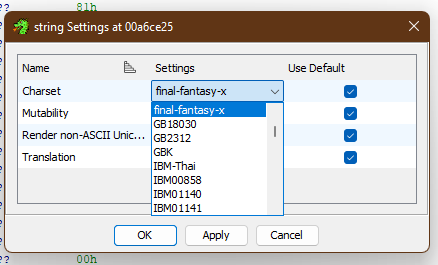
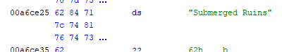

Java `Charset` and `CharsetProvider` for Final Fantasy X
===========================================

To be used with Ghidra.

This project is an implementation of `CharsetProvider` and `Charset`.
It contains a charset for Final Fantasy X's strings.

See [this comment](https://github.com/NationalSecurityAgency/ghidra/issues/2714#issuecomment-1162242324) that made this possible.

# Getting started
- Drop the jar file into Ghidra's `Ghidra/patch` directory.
- After you drop the .jar into Ghidra, you can right click on a string, select `Data -> Settings...` or `Data -> Default Settings...`, and pick your new encoding from the Charset list.

